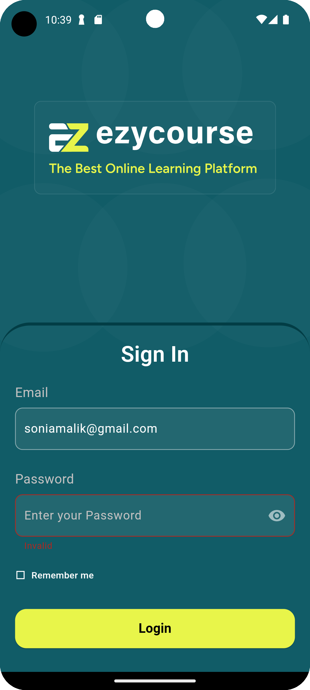
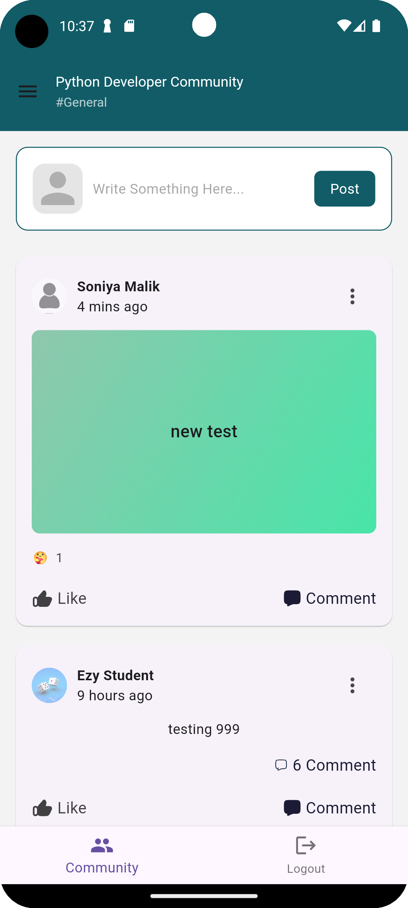
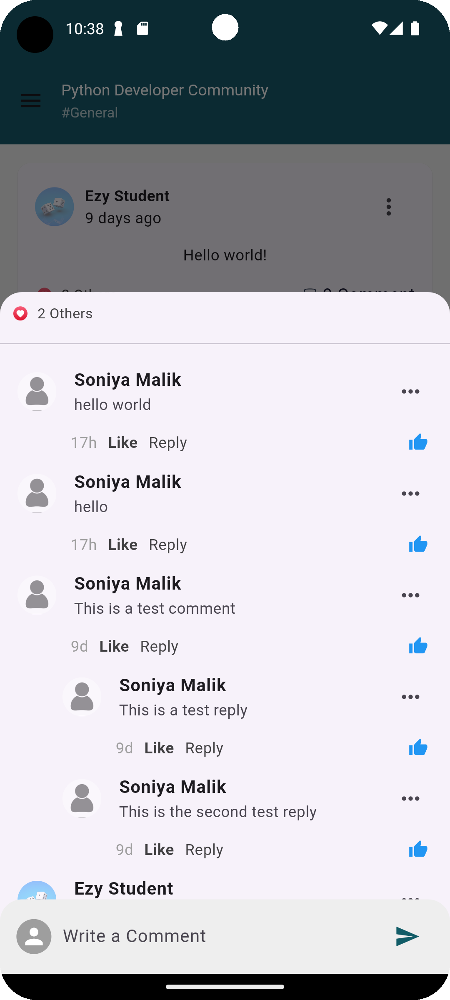
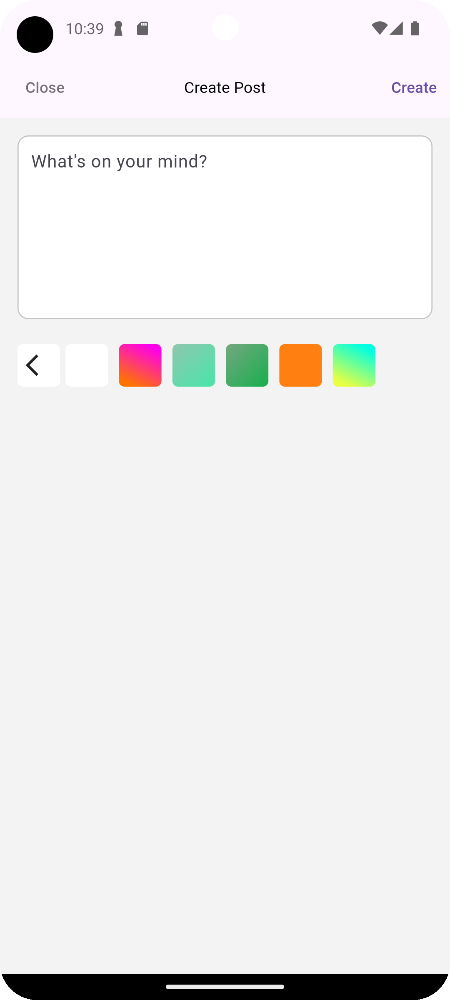

# Social Media App 📱

A **Flutter**-based social media app that follows the **MVC design pattern**, **clean code principles**, and **Provider for efficient state management**. The app ensures **smooth performance** with minimal package usage to maintain a small app size.

---

## ✨ Features Implemented

### ✅ **Authentication**
- **Login Page**: Secure user authentication with a modern UI.

### 📜 **Newsfeed**
- **Pagination Support**: Efficiently loads posts for better performance.
- **Post Creation**: Users can create posts with a **set gradient** feature.
- **Custom Reaction Bubble**: Implemented a **custom reaction bubble UI** for interactive reactions (like, love, laugh, etc.).
- **Minimal Package Usage**: Ensured a lightweight app build.

### 💬 **Reaction, Comments & Replies**
- **Reaction**: Users can add (Like, Love, Care, Sad etc.) reaction to the posts.
- **Comment Section**: Users can add comments on posts.
- **Comment Replies**: Nested replies for better conversation flow.

---

## 🏗 **Project Architecture**
This project follows the **MVC (Model-View-Controller) design pattern**, ensuring:
- **Separation of Concerns** 🏗: Organized code structure.
- **Maintainability** 🛠️: Easy to extend and debug.
- **Scalability** 🚀: Future enhancements can be integrated smoothly.

### 🧑‍💻 **State Management**
- Used **Provider** for **efficient and reactive state management**, making the app more responsive and reducing unnecessary rebuilds.

---

## 📸 **Screenshots**





## 🚀 **How to Run the App**
Follow these steps to set up and run the app on your local machine:

### **1️⃣ Prerequisites**
Make sure you have the following installed:
- [Flutter SDK](https://flutter.dev/docs/get-started/install)
- [Android Studio](https://developer.android.com/studio) or [VS Code](https://code.visualstudio.com/)
- A physical or virtual emulator (Android/iOS)

### **2️⃣ Clone the Repository**
```sh
git clone https://github.com/your-username/your-repo.git
cd your-repo


